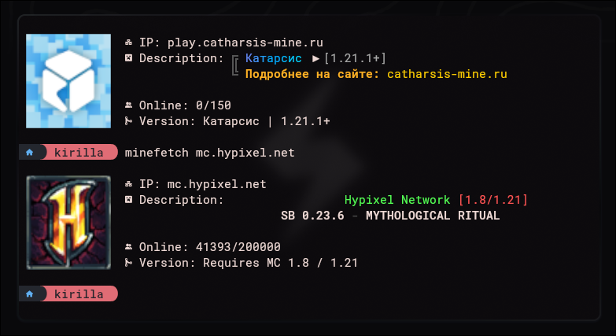

# Minefetch

Minefetch is a fastfetch-inspired tool for fetching minecraft server motd and displaying it with other data in your terminal without the need to launch the game.

*Currently works only with Kitty*



## Requirements
- C++17 compiler
- [nlohmann/json](https://github.com/nlohmann/json)
- CMake

## Building and installation
```sh
mkdir build
cd build
cmake ..
sudo make install
```

## Usage
```sh
minefetch <host> [port]
```
